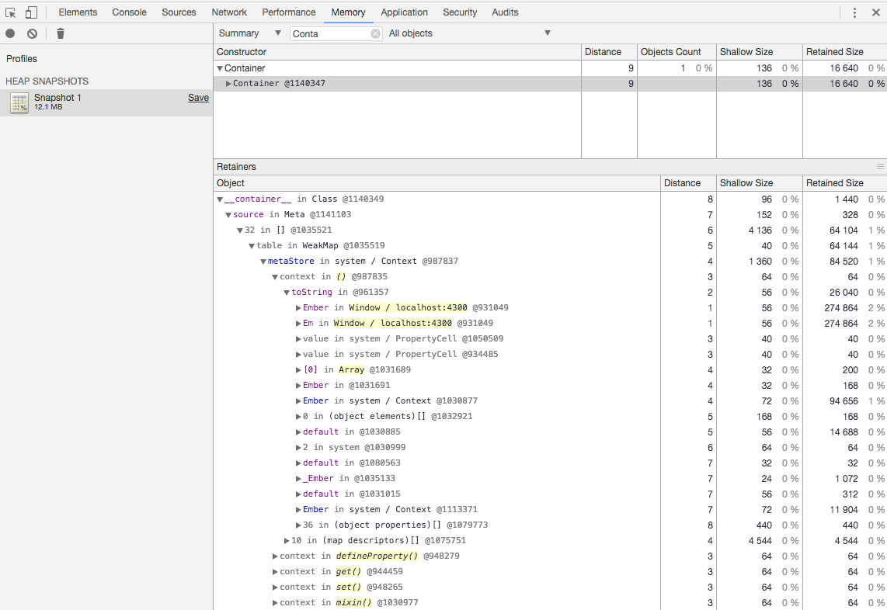

# ember-memleak

Reproduction for a potential memory leak in Ember 3.0 (and 3.1 beta).

Steps to reproduce:

* run the 'Memory leak' acceptance test
* create a heap snapshot in Chrome
* search for a `Container` instance (which should have been GCed after finishing the test)

